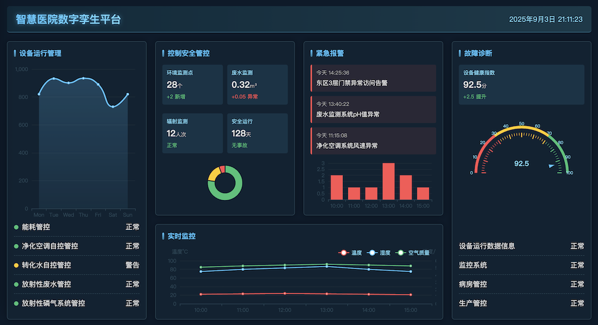

# 智慧医院数据大屏可视化

### 一、核心模块需求概述

#### 1. **设备运行管理**
   - **能耗管控**：需要对设备能耗进行监测与优化管理。
   - **净化空调自控管控**：要求空调系统具备自动控制与净化功能。
   - **转化水自控管控**：水处理系统需实现自动化控制。
   - **蓄电池放射性废水蓄变自控管控**：涉及放射性废水的储存与处理自动化。
   - **放射性磷气系统管控**：对放射性气体系统进行监控与管理。

#### 2. **控制安全管控**
   - **环境系统管控**：对环境参数（如温湿度、洁净度等）进行监控。
   - **废水监测系统管控**：对废水排放进行实时监测。
   - **人员辐射流量率监测系统**：对人员接触辐射的情况进行实时监测与记录。

#### 3. **紧急报警**
   - **监控系统**：需具备实时监控与异常报警功能。
   - **门禁系统**：接入门禁控制，确保区域安全。

#### 4. **故障诊断**
   - **检查设备运行数据信息**：系统应能收集和分析设备运行数据。
   - **监控监控管控**：可能为重复表述，应理解为对监控系统本身的管控。
   - **病房管控**：若为医疗场景，需对病房环境与设备进行管理。
   - **生产管控**：若为生产场景，需对生产过程进行监控与管理。

---

### 二、隐含需求分析

- **系统集成性**：多个子系统（空调、水处理、辐射监测等）需集成在一个平台中。
- **自动化程度高**：强调“自控”，需减少人工干预。
- **实时性与可靠性**：涉及辐射安全与紧急报警，系统需高可用、低延迟。
- **合规性要求**：可能需符合放射性物质管理、医疗或环保相关法规。
- **数据追溯与报告**：需支持数据查询、导出与报告生成，便于审计与故障分析。

---

### 三、建议的产品功能方向

1. **统一监控平台**：集成所有子系统，提供仪表盘、告警、日志等功能。
2. **智能告警与推送**：支持多方式（声光、短信、APP）告警，分级推送。
3. **数据分析与预测**：基于历史数据进行故障预测与能效分析。
4. **权限与门禁集成**：支持人员权限管理、区域访问控制。
5. **移动端支持**：便于远程监控与管理。
6. **合规性报告自动生成**：满足监管要求。

---

### 四、适用场景

- 医院放射性科室（如核医学科）
- 实验室或研究所涉及放射性操作的环境
- 工业放射性材料处理设施

---

这是一份关于**设备运行与安全管控系统**的需求概要，用于医疗、实验室或工业放射性环境管理。
